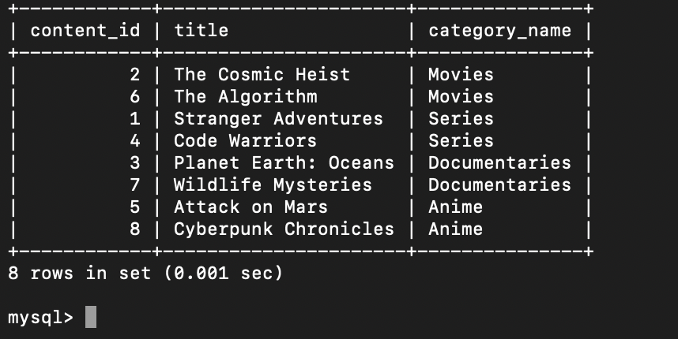
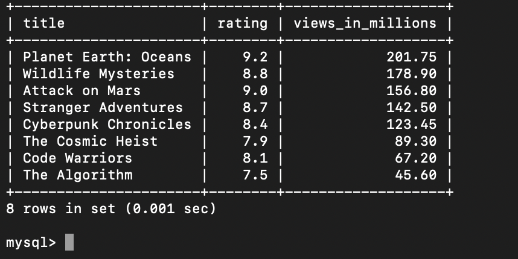
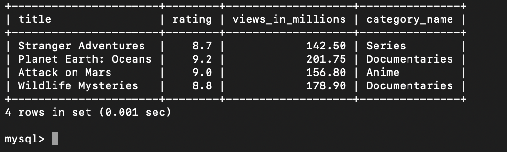
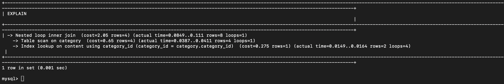
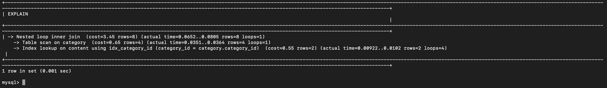

1)

mysql> select content_id , title , category_name from content inner join category on content.category_id = category.category_id;

2)

mysql> select title , rating , views_in_millions from content order by views_in_millions desc
    -> ;

3) 

mysql> select category_name , avg(rating) as average_rating from category inner join content on category.category_id = content.category_id group by category_name;

4)

mysql> select  title, rating, views_in_millions , category_name from category inner join content on category.category_id = content.category_id where rating > 8.5 and views_in_millions > 100 ;

5)

mysql> explain analyze select content_id , title , category_name from content inner join category on content.category_id = category.category_id;

mysql> create index idx_category_id on content(category_id);

mysql> explain analyze select content_id , title , category_name from content inner join category on content.category_id = category.category_id;

Total Execution time (When indexing was not done) : 0.0261 + 0.0024 + 0.0015 = 0.03 ms 

Total Execution time, when indexing was done : 0.0153 + 0.0013 + 0.00098 = 0.01758 ms 

Since, the execution time has been reduced after indexing has been applied , so yes performance has been improved. 

There is an index lookup on content(category_id) while performing an inner join between category and content i.e (contegory.category_id = content.category_id) . This search of category_id in content table is very fast (can be done in log(N) time) due to indexing and we will not require to perform full table search scan.

6)

The foreign key ensures that the value in one table should exist in other table. This helps in preventing that no faulty or random value is inserted in the table . So, if we try to insert a content record with category_id = 999 , but similar category_id is not present in category table  then it will give us with error.

7) 

ACID -> Atomicity , Consistency , Isolation , Durability 

Atomicity : Either whole of the transactions happens or none happens . If 1000 users are trying to update the view_cnt value , maybe only partial increase in the view count value happens if there is no atomicity . Atomicity ensures that either everyone is able to update the value of view_cnt or no one is able to update the value of view_cnt.

Consistency : The database should remain in consistent state before and after the transactions. Consistency ensures that rules like foreign keys, data types and constraints remain valid.Without it , the view count might become negative.Data becomes logically impossible. Database no longer reflects real-world truth.

Isolation : It helps in multiple transactions run concurrently without interfering each other. Without it , suppose Transaction A read view_cnt as 500 and Transaction B read view_cnt as 500 simultaneously and both set the view_cnt as 501 . But logically view_cnt should be 501.

Durability : It guarantees data is saved permanently after transactions commit. Without it , suppose you increase the view_cnt to 501 , the server crashes and the updates never get saved.Views revert back to 500. Now your database lies about real views.

8) 

Creating index on category_id prevents doing a full-table scan . It optimises the query by turning the search from O(N) to O(log(N)) using B-trees behind the scenes. A table with a size of million can be searched within few steps.

